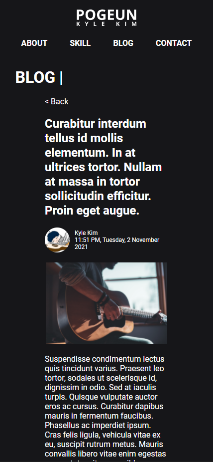

    

# **Kyle Joo Hwan Kim Portfolio Website**
## **Link to the published portfolio webste**
https://pogeun.github.io/

&nbsp;

## **Link to the GitHub repository**
https://github.com/Pogeun/pogeun.github.io

&nbsp;

## **Description of portfolio website**
### **Purpose**
This is the very first website that I have built for myself to showcase about me. The current version of the website only utilizes very limited amount of [JavaScript](https://developer.mozilla.org/en-US/docs/Web/JavaScript) whilst the rest is built with the combination of [HTML](https://developer.mozilla.org/en-US/docs/Web/HTML) & [CSS](https://developer.mozilla.org/en-US/docs/Web/CSS). However, I am willing to expand the features and functions with JavaScript so that this website is more user interactive.

&nbsp;

### **Functionality / features**
* **Shared**
  * Logo
    * sends the user back to the Index page
  * Navigation
    * contains four links (About, Skill, Blog & Contact)
* **Index**
  * "Learn more about me"
    * re-directs the viewer to the About page
  * Image
* **About**
  * Contact details
  * External links to GitHub, LinkedIn & Instagram
  * Introduction paragraphs
  * Images
  * Embedded Google maps
  * Embedded Spotify player
* **Skill**
  * External link to resume
  * PDF viewer for resume
    * *iframe* version of PDF viewer
  * Image slide show of skills
    * JavaScript powered image slide show
* **Blog**
  * Blog post preview with:
    1. Image
    2. Title
    3. A paragraph of the post
    4. "Read full article" button
* **Blog post**
  * Blog post with:
    1. Title
    2. Profile image & full name of the author
    3. Date published
    4. Image
    5. Context
    6. "Back" button
* **Contact**
  * Brief welcoming message
  * Contact form with:
    1. First name text box
    2. Last name text box
    3. Email text box
    4. Message text area
    5. Submit button
  * External links to GitHub, LinkedIn & Instagram

&nbsp;

### **Sitemap**

    

&nbsp;

### **Screenshots**
* **Index**

* **About**

* **Skill**

* **Blog**

* **Blog post**

* **Contact**

&nbsp;

### **Target audience**
The primary target audience would be a recruiter or a human resource manager who is showing their interest on me and project & skills that I have been working on. The next would be those who are personally interested into my work.

&nbsp;

### **Tech stack (e.g. html, css, deployment platform, etc)**
* **Programming Language**
  * [HTML (Hypertext Markup Language)](https://developer.mozilla.org/en-US/docs/Web/HTML)
  * [CSS (Cascade Style Sheet)](https://developer.mozilla.org/en-US/docs/Web/CSS) + [SCSS (Syntactically Awesome Style Sheets)](https://sass-lang.com/)
  * [JavaScript](https://developer.mozilla.org/en-US/docs/Web/JavaScript)
* **System Environment**
  * [Windows 10](https://www.microsoft.com/en-au/software-download/windows10)
  * [WSL (Windows Subsystem for Linux)](https://docs.microsoft.com/en-us/windows/wsl/)
* **Software**
  * [VS Code (Visual Studio Code)](https://code.visualstudio.com/)
  * [Git](https://git-scm.com/)
  * [Adobe XD](https://www.adobe.com/au/products/xd.html)
  * [Adobe Illustrator](https://www.adobe.com/au/products/illustrator.html)